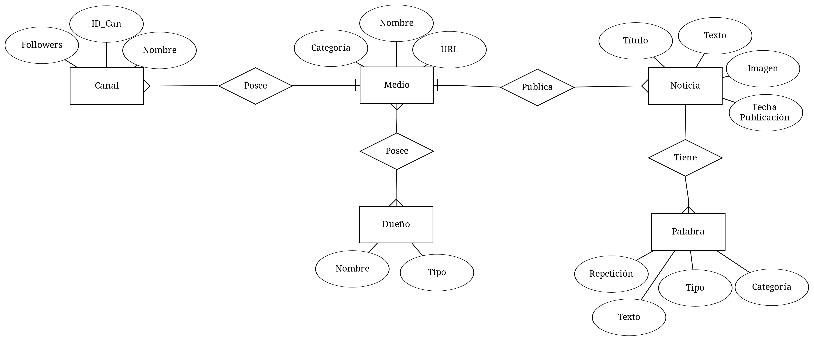

### 1. Modelo Entidad-Relación

### 2. Modelo Relacional

* medio (__ID_Med__, nombre, url, categoria)
* canal  (__ID_Can__, #ID_Med, nombre, followers)
* posee (__#ID_Med, ID_Due__)
* dueño (__ID_Due__, nombre, tipo)
* noticia (__ID_Not__, #ID_Med, titulo, texto, imagen, fecha, publicacion)
* palabra(__ID_Pal__, #ID_Not, texto, repeticion, tipo, categoria)

### 3. Consultas SQL

3.1 Mostrar el número de medios que poseen (totalmente o parcialmente) cada dueño, ordenado del dueño que posee más medios al dueño que posee menos medios.

~~~sql
SELECT ID_Due, COUNT(*) AS Posee
FROM posee
GROUP BY ID_Due
ORDER BY Posee DESC;
~~~

3.2 Mostrar el número de noticias por medio entre dos fechas al formato YYYY-MM-DD, mostrando los 10 principales medios.

~~~sql
SELECT nombre, COUNT(*)
FROM noticia
INNER JOIN medio
WHERE fecha
BETWEEN YYYY-MM-DD1 AND YYYY-MM-DD2
GROUP BY ID_Med
ORDER BY COUNT(*) DESC
LIMIT 10;
~~~

3.3 Mostrar la lista de adjetivos y sustantivos más utilizados en las noticias que utilizan la palabra "mujer", mostrando solamente los que aparecen al menos 50 veces.

~~~sql
//Coregir
SELECT texto, repeticion
FROM palabra
INNER JOIN noticia
USING (ID_Not)
WHERE tipo 
IN (adjetivo, sustantivo)
AND
WHERE titulo
LIKE '% mujer %'
~~~

3.4 Mostrar los medios que no utilizaron la palabra compuesta "justicia social" en sus noticias del mes pasado.

~~~sql
~~~

3.5 Mostrar el número de noticias promedio por día por cada medio.

~~~sql
~~~

3.6 Mostrar el dueño que más utiliza palabras simples o compuestas que contienen la palabra "libertad" en sus medios, mostrando los que no la utilizan al menos 10 veces.

~~~sql
~~~

3.7 Mostrar cómo evoluciona la frecuencia de aparición de la palabra "democracia" cada año.

~~~sql
~~~