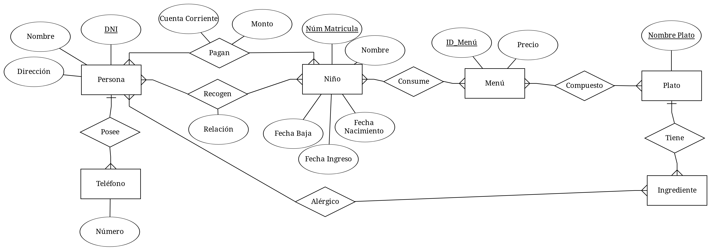
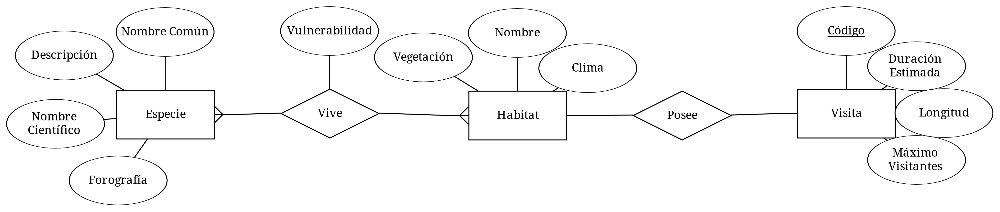

### Ejercicio 2

#### 2.1 Modelo Entidad-Relación

#### 2.2 Modelo Relacional

* niño(__Num_Matricula__, nombre, fecha_nacimiento, fecha_ingreso, fecha_baja)
* recojer(__#Num_Matricula, #DNI__, relacion)
* persona(__DNI__, nombre, direccion)
* pagar(__#Num_Matricula, #DNI__, cuenta_corriente, monto)
* telefono(__ID_Telefono, #DNI__, numero)
* poseer(__#DNI, #ID_Telefono__)
* consume(__#Num_Matricula, #ID_Menu__, fecha)
* menu(__ID_Menu__, precio)
* compone(__#ID_Menu, #Nombre_Plato__)
* plato(__Nombre_Plato__)
* tiener(__#Nombre_Plato, #Nombre_Ingrediente__)
* ingrediente(__Nombre_Ingrediente__)
* alergico(__#Num_Matricula, #Nombre_Ingrediente__)

#### 3.3 Consultas SQL

### Ejercicio 3

#### 3.1 Modelo Entidad-Relación

#### 3.2 Modelo Relacional

* especie(__ID_Especie__, nombre_comun, nombre_cientifico, descripcion, fotografia)
* vive(__#ID_Especie, #ID_Habitat__, vulnerabilidad)
* habitat(__ID_Habitat__, #codigo, nombre, clima, vegetacion)
* visita(__codigo__, duracion_estimada, longitud, maximo_visitante)

#### 3.3 Consultas SQL

3.3.1 Mostrar cuántas especies distintas viven en cada tipo de habitats

~~~mysql
SELECT h.nombre, COUNT(*)
FROM especie
INNER JOIN vive
USING (ID_Especie)
INNER JOIN habitat h
USING (ID_Habitat)
GROUP BY h.nombre;
~~~
 
3.3.2 Mostrar cuántos habitats hay por cada itinerario

~~~mysql
SELECT codigo, COUNT(*)
FROM habitat
GROUP BY codigo;
~~~

3.3.3 Mostrar el itinerario que tiene más habitats

~~~mysql
SELECT codigo, COUNT(*)
FROM habitat
GROUP BY codigo;
ORDER BY COUNT(*) DESC
LIMIT 1;
~~~

3.3.4 Mostrar los itinerarios que permiten al menos 100 especies distintas

~~~mysql
SELECT codigo, COUNT(*)
FROM especie
INNER JOIN vive
USING (ID_Especie)
INNER JOIN habitat
USING (ID_Habitat)
GROUP BY codigo
HAVING COUNT(*) >= 100;
~~~

3.3.5 Mostrar en qué habitats viven especies que contienen la palabra 'Chile' en su descripción (mostrar nombre de especie y habitat)

~~~mysql
SELECT codigo, COUNT(*)
FROM especie
INNER JOIN vive
USING (ID_Especie)
INNER JOIN habitat
USING (ID_Habitat)
WHERE descripcion
LIKE '%Chile%';
~~~