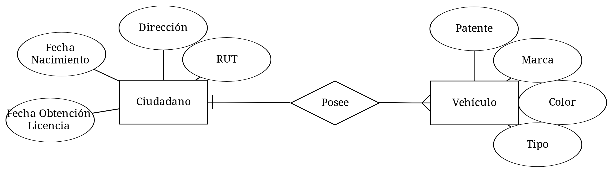

### 1. Sistema de gestión de permisos de circulación en la ciudad de Valdivia 

### 2. Sistema de gestión de una empresa de transportes
.png)

### 3. Sistema de información Carreteras
.png)

### 4. Sistema de gestión de un hospital
.png)

### 5. Artı́culos y encargos
.png)
